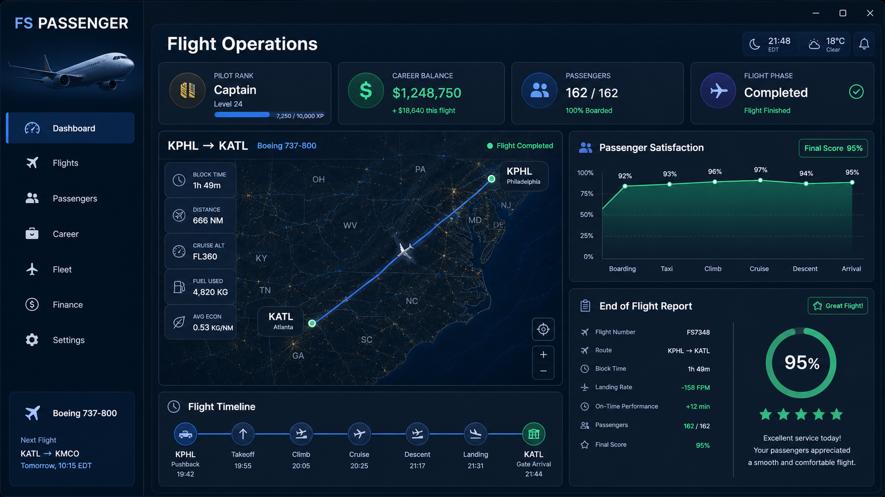

  

# USA Flight Club Passengers — Releases

> Official public release-notes, installer, and update channel for **USA Flight Club Passengers**.

## Design direction

*Concept image — visual direction only. It does not represent a currently released build or confirm that every illustrated feature is available.*

## About this repository

This public repository is reserved for verified installer packages, automatic-update metadata, checksums, and release notes. Application source code, private services, and operational integrations remain in private repositories and are **not** distributed here.

## Download and install

When a production build is published:

1. Open [Releases](../../releases).
2. Download the current `USAFlightClubPassengers-Setup.exe` asset.
3. Verify its SHA-256 checksum against the release notes.
4. Run the installer only when the download is from this official repository and the checksum matches.

The installer will create the application under `C:\Program Files\USA Flight Club Passengers\`. User data remains under `%AppData%\USAFlightClubPassengers\`.

## Release integrity

Release assets must be accompanied by SHA-256 checksums and versioned notes. Never install packages from a fork, mirror, or unsolicited link.

## Support and security

- Product support: use the provided GitHub issue template.
- Security vulnerabilities: follow [SECURITY.md](SECURITY.md). Do not post vulnerabilities in public issues.
- Privacy and data practices: see [PRIVACY.md](PRIVACY.md).

## Current status

No installer or deployment release has been published yet. This repository currently provides the official release-channel documentation and design reference only.

---

Copyright © 2026 USA Flight Club. All rights reserved. USA Flight Club Passengers is proprietary software.
