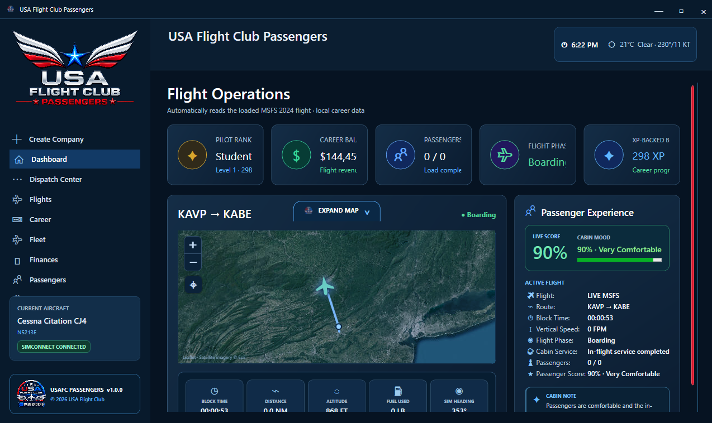
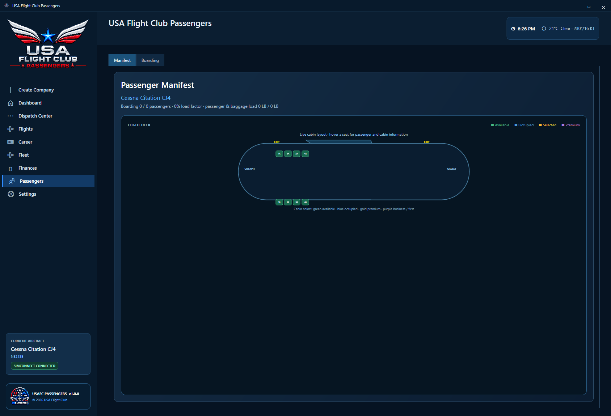
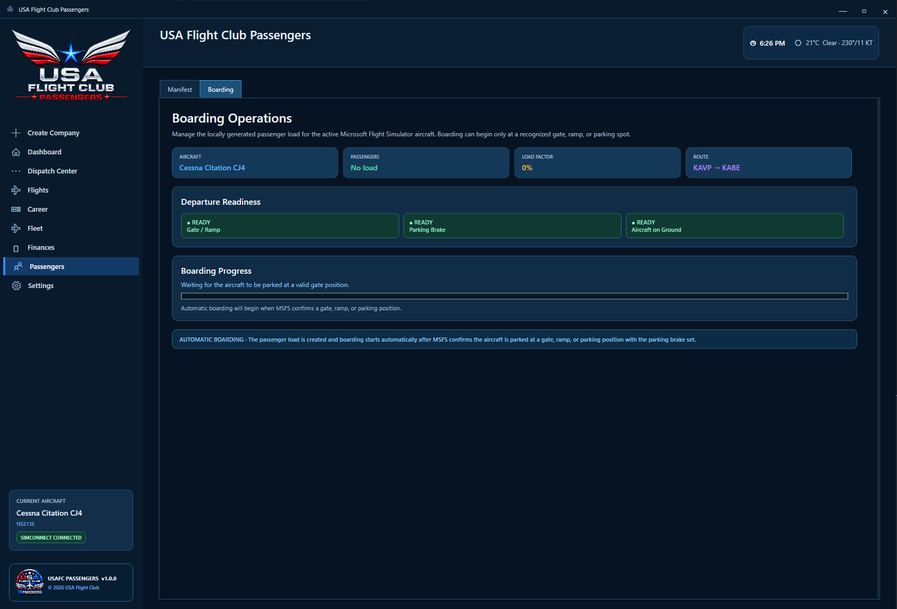
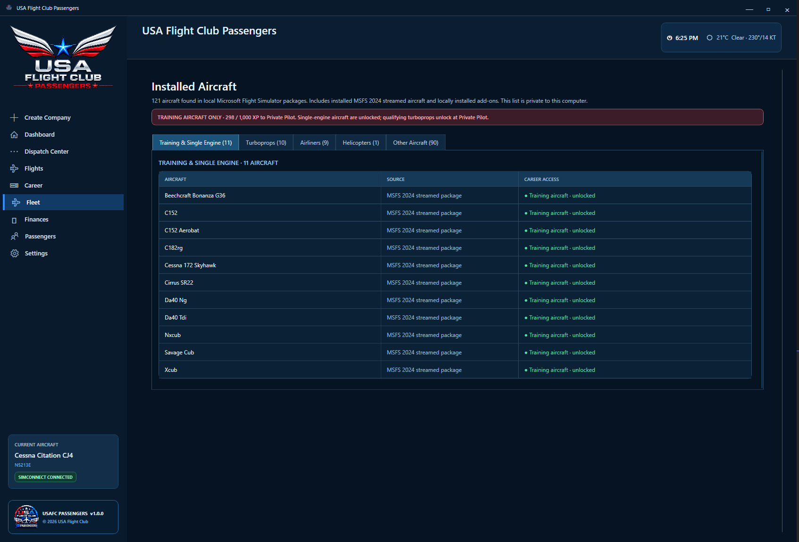
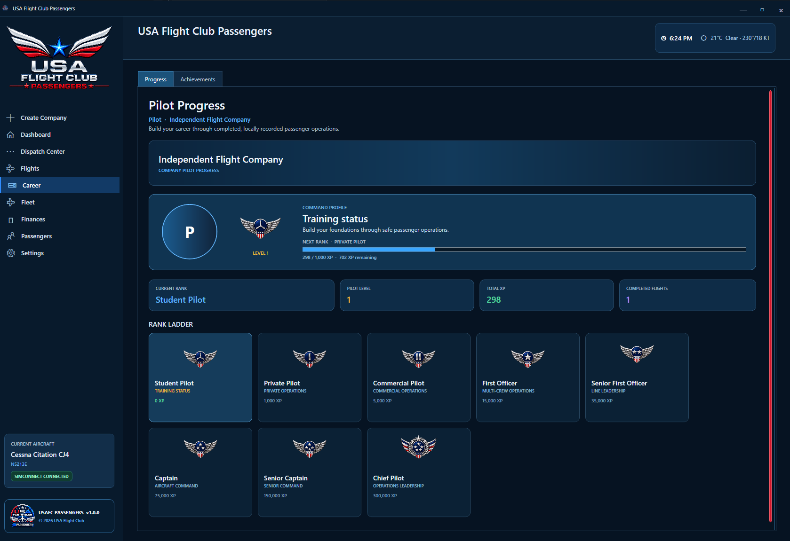
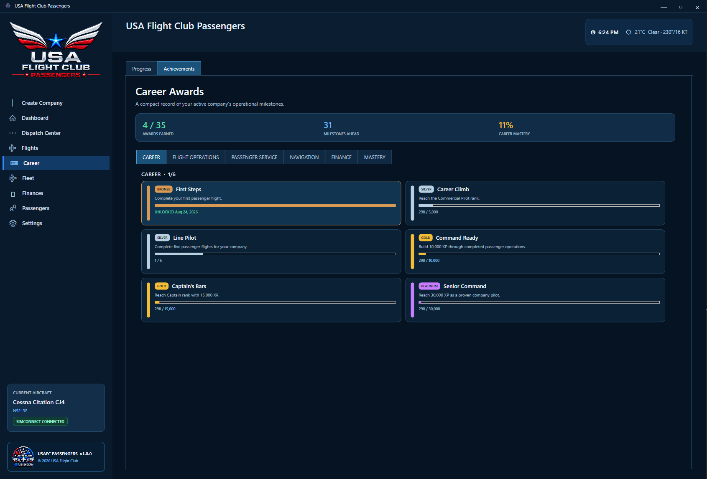
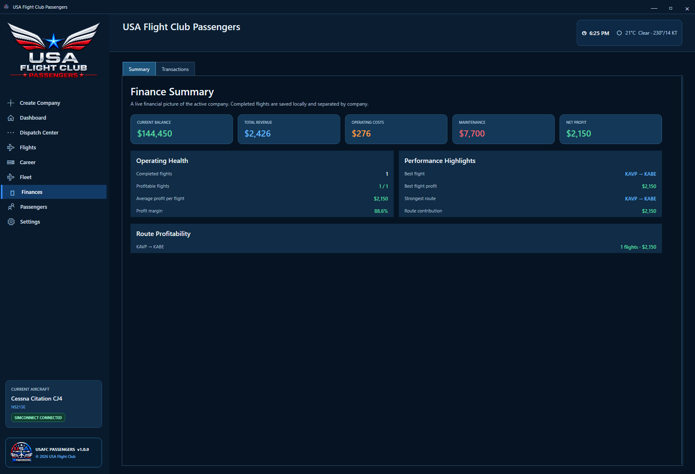
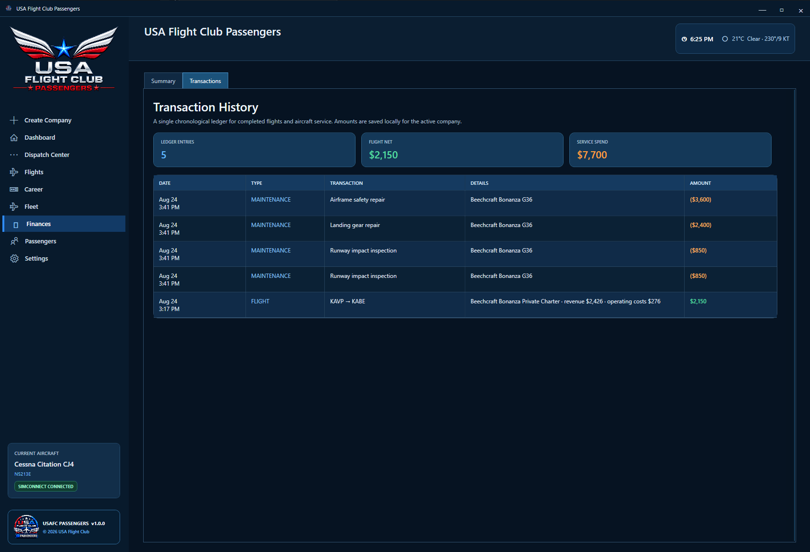
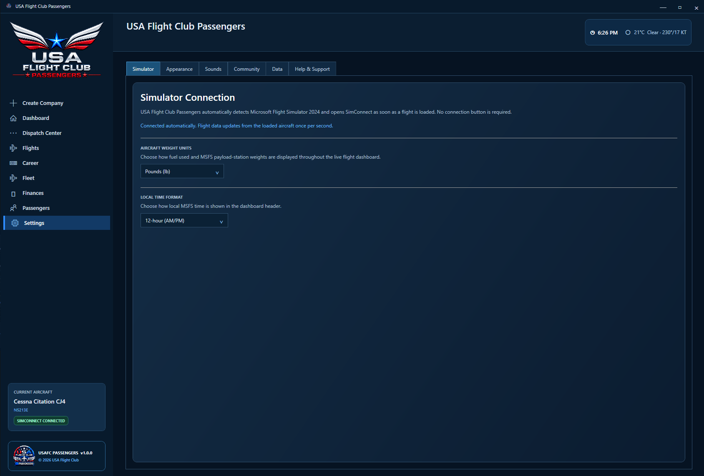

  

# USA Flight Club Passengers — Releases

> Official public release-notes, installer, and update channel for **USA Flight Club Passengers**.

## Application preview

The screenshots below show the current product direction. Visual details may change before a production installer is published.

  

| | |
|---|---|
|  |  |
| **Create Company** | **Flight Planner** |
|  |  |
| **Passenger Manifest** | **Boarding Operations** |
|  |  |
| **Dispatch Center · Virtual Cabin, boarding readiness, and flight controls** | **Fleet Management** |
|  |  |
| **Pilot Career** | **Achievements** |
|  |  |
| **Finances** | **Transaction History** |
|  | |
| **Settings** | |

## Current application capabilities

- **Dispatch Virtual Cabin** — one live place for boarding readiness, passenger load progress, Flight Controls, cabin phase, and the active company flight list.
- **Performance-based passenger scoring** — passenger experience is assessed across each phase using taxi handling, vertical rates, weather/turbulence, MSFS stall and overspeed warnings, go-arounds, landing quality, fuel reserve, and cabin service.
- **Persistent aircraft condition** — locally tracked airframe and engine hours, cycles, tires, brakes, oil condition, inspections, defects, maintenance requirements, and maintenance costs.
- **Flight Review and replay** — completed flights retain phase scorecards, timestamped operational events, a score breakdown, and a saved map replay in Flight History.
- **Local-first data** — companies, pilots, finances, achievements, active flights, Flight Reviews, and backups stay on the user's computer.

## About this repository

This public repository is reserved for verified installer packages, automatic-update metadata, checksums, and release notes. Application source code, private services, and operational integrations remain in private repositories and are **not** distributed here.

## Download and install

When a production build is published:

1. Open [Releases](../../releases).
2. Download the current `USAFlightClubPassengers-Setup.exe` asset.
3. Verify its SHA-256 checksum against the release notes.
4. Run the installer only when the download is from this official repository and the checksum matches.

The installer will create the application under `C:\Program Files\USA Flight Club Passengers\`. User data remains under `%AppData%\USAFlightClubPassengers\`.

## Release integrity

Release assets must be accompanied by SHA-256 checksums and versioned notes. Never install packages from a fork, mirror, or unsolicited link.

## Support and security

- Product support: use the provided GitHub issue template.
- Security vulnerabilities: follow [SECURITY.md](SECURITY.md). Do not post vulnerabilities in public issues.
- Privacy and data practices: see [PRIVACY.md](PRIVACY.md).

## Current status

No installer or deployment release has been published yet. This repository currently provides the official release-channel documentation and design reference only.

---

Copyright © 2026 USA Flight Club. All rights reserved. USA Flight Club Passengers is proprietary software.
